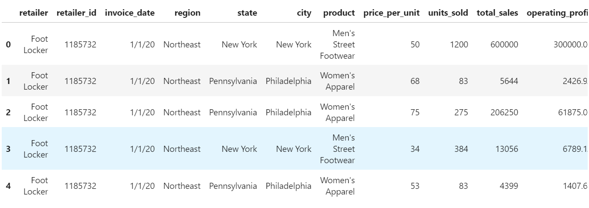

**Background**  
In this repo:  
Aanalyzing sales data to gain insights into which cities in the U.S. have sold the most athletic wear over two years.  Determine which retailers had the greatest total sales for athletic wear, and which retailers sold the most women's athletic footwear. Finally, determine which day and week had the highest sales for women's athletic footwear.  

**Steps**  
***Combine and Clean the Data***
* Import the two CSV files, athletic_sales_2020.csv and athletic_sales_2021.csv, and read them into DataFrames.  

* Check that the columns in the two DataFrames have similar names and data types.  

* Combine the two DataFrames by the rows using an inner join, and reset the index.  
* After combining the DataFrames, do the following:  

- Check if there are any null values.  

- Check each column’s data type.

- Convert the "invoice_date" column to a datetime data type.

- Confirm that the data type has been changed. 
 
*Requirements*  

***Combine and Clean the Data***  
Output  
  
***Determine which Region Sold the Most Products***  
Output  
  
***Determine which Region had the Most Sales***  
Output  
  
***Determine which Retailer had the Most Sales***  
Output  
  
***Determine which Retailer Sold the Most Women's Athletic Footwear***  
Output  
  
***Determine the Day with the Most Women's Athletic Footwear Sales***  
Output  
  
***Determine the Week with the Most Women's Athletic Footwear Sales***  
Output  
  

